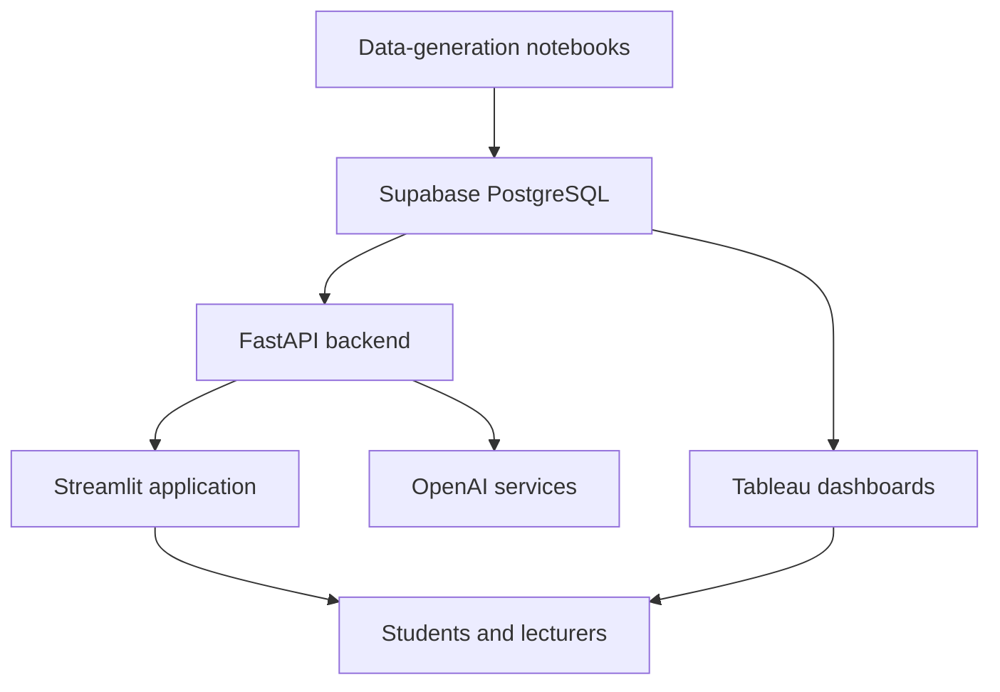

# System Architecture

## Purpose and scope

The platform is designed as a modular learning analytics MVP. It combines student performance data, learning materials, analytics, dashboards, and AI-powered support in one application.

The current project uses synthetic data. A connection to a school student information system is part of the proposed future architecture, not part of the implemented prototype.

## High-level architecture

## Component responsibilities

### Synthetic data and notebooks

The notebooks in `notebooks_datasets/` create quiz, test, engagement, and question-bank data for development and demonstration. They also contain data-loading and modelling work.

Synthetic data is used instead of real student records so the project can be developed without exposing personal or school-owned information.

### Supabase and PostgreSQL

Supabase provides the hosted PostgreSQL database and supporting backend services. It stores assessment data, learning materials, and vector embeddings used for retrieval.

Database views and SQL functions perform recurring calculations such as:

- Listing modules and subtopics
- Calculating weighted scores
- Returning student and cohort summaries
- Finding incorrect or commonly missed questions
- Retrieving relevant learning-material chunks

The `pgvector` extension supports similarity search for the RAG workflow.

### FastAPI backend

`main.py` exposes the API used by the Streamlit application. It acts as the integration layer between the front end, Supabase, and OpenAI services.

The API includes endpoints for student data, lecturer summaries, document retrieval, chat, and incorrect-answer explanations. Keeping these calls in the backend also gives the project a place to protect service credentials and change integrations independently of the interface.

### Streamlit application

`app.py` is the main user interface. It routes users to student and lecturer views and uses the modules in `pages/` and `components/` to render dashboards, charts, AI features, and interactive learning content.

### OpenAI services

OpenAI models support text generation, embeddings, text-to-speech, and transcription. The generated audio, captions, and background video are combined locally with FFmpeg for the interactive-learning feature.

### Tableau

Tableau provides additional interactive dashboards using data from Supabase. It is a separate dashboard layer from the Streamlit interface.

## Main data flows

### Student flow

1. The student signs in through the Streamlit interface.
2. The application requests module, subtopic, score, and question data from FastAPI.
3. FastAPI queries Supabase through SQL functions and views.
4. Streamlit displays charts and sends selected learning requests to the AI service.
5. AI responses are displayed or cached in the student session where appropriate.

### Lecturer flow

1. The lecturer opens the lecturer view.
2. The application requests cohort summaries, rankings, subtopic performance, and commonly missed questions.
3. FastAPI retrieves the required results from Supabase.
4. Streamlit and AI services turn the results into charts, summaries, and suggested focus areas.

### AI explanation flow

1. The student selects an incorrect question.
2. The question is converted into an embedding.
3. Supabase returns the most similar learning-material chunks for the selected module.
4. FastAPI adds the retrieved context to the prompt.
5. The model generates a concise explanation and cites the retrieved document names when relevant.
6. If the similarity score is too low, the request falls back to a general explanation.

## Configuration and security

The application loads configuration from environment variables, including the OpenAI key, Supabase URL, Supabase keys, and FastAPI URL. Secrets must stay on the backend and must not be committed to the repository.

The current `require_user` function is a demonstration placeholder. A production deployment would need verified authentication tokens, role-based access, row-level data restrictions, and proper secret management.

## Design decisions

- **Supabase** provides a managed PostgreSQL database with APIs and vector support, reducing backend setup time.
- **FastAPI** separates backend integrations from the Streamlit interface and provides a central place for AI requests.
- **Streamlit** supports rapid development of a data-heavy Python application.
- **Tableau** provides flexible dashboard exploration for users who need to inspect cohort data.
- **Synthetic data** enables development without using real student records.

## Limitations

- The school-system data source is hypothetical; no real extraction or ETL process is included.
- The current authentication layer is not production-ready.
- The architecture depends on external Supabase, OpenAI, and Tableau services.
- Streamlit and Tableau are separate presentation layers, so their features and access controls must be kept consistent.
- AI requests can introduce latency and operating costs as usage grows.

## Future improvements

- Add an approved, secure ingestion process for real institutional data.
- Implement verified authentication and role-based access control.
- Add database migrations and environment-specific deployment configuration.
- Improve observability, error handling, and request-level logging without recording sensitive student data.
- Replace or complement Streamlit with a more customisable front end if the platform needs larger-scale production use.

[← Back to README](../README.md)
